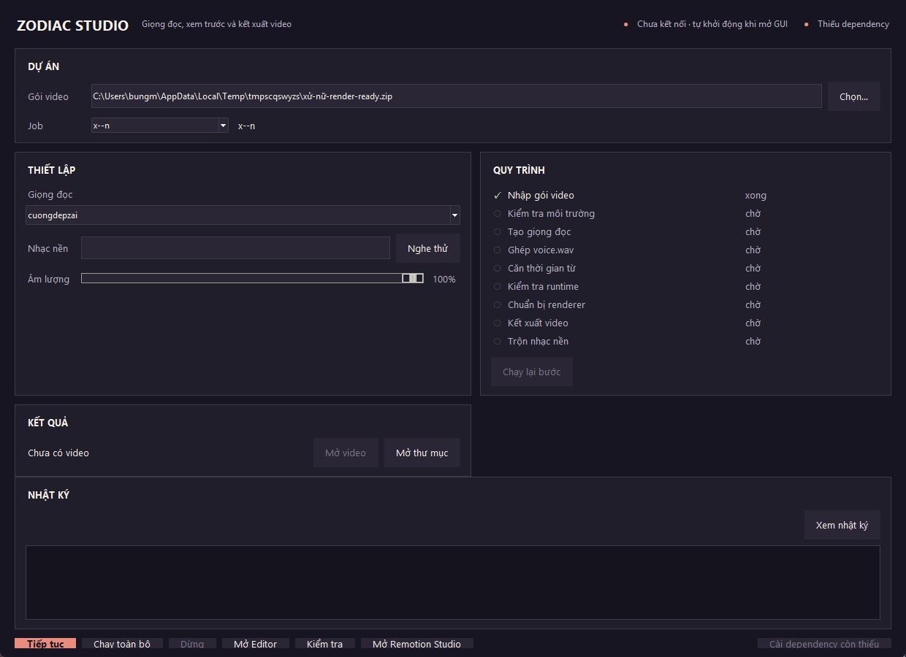

# Zodiac Video local runner

Local runtime for **zodiac-video-pipeline v2.1**, whose default handoff is
`zodiac-job@5` for `zodiac-renderer@2.0.0`.

For Job@5, the plugin owns evidence, story, narration, semantic Authoring IR,
design tokens and referenced assets. This repository owns local voice
generation/attachment, measured timing, render-plan compilation, rendering and
final audio mix. Legacy Job@2–4 packages remain supported through the older
`tools/zodiac_local.py` workflow.

## Requirements

- Python 3.9+
- Node.js + npm
- FFmpeg on `PATH` for background-music preview/final mix
- VieNeu-TTS at `E:\\projects\\VieNeu-TTS` for the built-in local voice flow, or attach your own `voice.wav`
- `faster-whisper` for automatic word-level timing:

```bash
python -m pip install -r requirements-local.txt
```

The first alignment run may download the selected Whisper model. Default alignment is `small` on CPU/int8.

## Current package: Job@5

The Job@5 ZIP contains exactly:

```text
package-manifest.json
production.ir.json
design-token.json
narration.txt
assets/**                 # only assets referenced by production.ir.json
publish/publish.json
publish/publish-copy.txt
```

The incoming ZIP must not contain timing or other local runtime state. Import
checks the package schema, canonical contract hash, renderer version, ordered
narration, publish references, and exact asset references before writing the
workspace. Measured timing lives at `.runtime/timing.json`; it is created or
attached after import.

Use the Textual app to import and run Job@5 packages:

```bash
uv run zodiac
```

The direct compiler uses the same canonical timing path:

```bash
zodiac-control build "/path/to/imported-job"
```

### Legacy Job@2–4 package compatibility

The legacy runner below accepts older Job@2–4 exports. New plugin exports use
Job@5.

A thin package v4 ZIP is creative data only:

```text
package-manifest.json     # zodiac-job@4, runtime id/version only
design.md
narration.txt
production.json           # production contract 2.0
publish/
README.md                  # optional human-facing handoff
assets/                    # only assets referenced by production.json
```

A v4 ZIP must not contain `.authoring/`, `renderer/`, `library/`, `references/`,
`node_modules/`, `.runtime/`, `out/`, `voice.wav`, `FINAL_VALIDATION.json`,
or `handoff-manifest.json`.

The package selects an exact runtime **id + version**. Zodiac Studio resolves that
runtime from its local registry and verifies the bundled/cached renderer against
the local `runtime-manifest.json`. Runtime SHA-256 is therefore a Studio concern,
not package metadata, and Studio never falls back to "latest".

Studio validates the production entity/state/event contract, the design token,
Patrick Hand caption contract, SVG safety/style, asset lineage, semantic animation,
canonical narration, and referenced-asset boundary directly from the creative
package. After local TTS, measured alignment, runtime checks, video and cover
exist, Studio writes `out/FINAL_VALIDATION.json` and includes it in the publish
bundle.

Compatibility:
- legacy v2 ZIPs without `package-manifest.json` continue to use package-local `renderer/`;
- `zodiac-job@3` remains accepted with its existing runtime/design hashes and
  semantic `FINAL_VALIDATION.json` receipt;
- `zodiac-job@4` remains accepted for older plugin exports;
- current plugin v2.1 exports default to `zodiac-job@5`.

Old v1 packages using `actors/objects/actions/motion` are intentionally rejected.
See `docs/THIN_PACKAGE_V4_SPEC.md` and `docs/THIN_PACKAGE_V3_SPEC.md` for the
legacy compatibility contracts. The Job@5 package contract is defined by the
`zodiac-video-pipeline` v2.1 handoff.

## Legacy quick start (Job@2–4)

Import:

```bash
python tools/zodiac_local.py import "/path/to/zodiac-render-ready.zip"
```

Check:

```bash
python tools/zodiac_local.py check zodiac-sun-gemini
```

### Generate VieNeu voice + measured words

```powershell
python tools/zodiac_local.py voice zodiac-sun-gemini --voice "Hải Đăng"
```

The voice flow:

1. generates one PCM WAV per production scene;
2. concatenates them into `voice.wav`;
3. uses faster-whisper forced word timing against each approved `scene.voice`;
4. writes word-level `.runtime/timing.json`.

The aligner does **not** distribute a scene duration evenly across words. If recognized word order does not match approved narration, the command stops instead of inventing timing.

Optional aligner controls:

```bash
--align-model small
--align-device cpu
--align-compute-type int8
```

To reuse a running VieNeu Gradio service:

```powershell
python tools/zodiac_local.py voice zodiac-sun-gemini \
  --voice "Hải Đăng" \
  --vieneu-url http://127.0.0.1:7860
```

### Attach externally measured voice/timing

```bash
python tools/zodiac_local.py attach zodiac-sun-gemini \
  --voice "/path/to/voice.wav" \
  --timing "/path/to/timing.json"
```

Timing must contain one measured token per spoken word. This is required by v2 for:

- phrase/page captions;
- active-word highlighting;
- `voice_anchor` event resolution;
- intra-scene character/object/camera animation.

## Preview vs render

```bash
python tools/zodiac_local.py preview zodiac-sun-gemini
python tools/zodiac_local.py render zodiac-sun-gemini
```

**Preview means Remotion Studio**, an interactive long-running process. It is not a short MP4 preview.

Before preview/render the runner:

1. validates local voice + word timing;
2. resolves the exact pinned renderer runtime;
3. installs pinned runtime dependencies only when that shared runtime is not already prepared;
4. verifies the compiled style token;
5. runs runtime contract tests + TypeScript once per runtime hash;
6. lets the canonical renderer create `.runtime/render-props.json`, resolve `voice_anchor` events, and render against the job root as its public asset directory.

For v3, captions, event resolution, visual states, SFX and transitions are owned by the trusted shared runtime, not executable code inside the ZIP. `zodiac-remotion@1.14.0` remains the immutable thin-package baseline; `zodiac-remotion@1.15.0` adds the semantic lineage/mechanism contract and executes the Semantic Animation Gate. Multiple jobs using the same runtime reuse the same source, `node_modules`, and runtime-check cache. Legacy v2 jobs keep package-local renderer compatibility repair for older exports.

## Background music

GUI volume range is **0–100%**. 100% means gain `1.0` relative to the source file.

The selected track is copied to package-local `media/` and its local setting is stored in:

```text
.runtime/audio.json
```

Remotion renders voice + SFX first. The local runner then post-mixes the selected background track into the final MP4 with FFmpeg. This keeps the plugin's canonical renderer unchanged.

CLI example:

```bash
python tools/zodiac_local.py render zodiac-sun-gemini \
  --music "/path/to/music.mp3" \
  --music-volume 0.45
```

Disable:

```bash
python tools/zodiac_local.py render zodiac-sun-gemini --no-music
```

### Nghe thử

The GUI has **Nghe thử**. It creates a 10-second `voice.wav + music` mix at the current slider value.

If `voice.wav` is shorter than 10 seconds, silence is padded so the preview still lasts exactly 10 seconds. The file is opened with the native launcher:

- Windows: `startfile`
- macOS: `open`
- Linux: `xdg-open`

## Zodiac TUI (khuyến nghị)

TUI là control plane mặc định cho local workflow. **Remotion Studio hiện tạm tắt
trong workflow TUI** vì runtime hiện chỉ cung cấp preview/debug, chưa có authoring
/save-back đủ hữu ích. TUI hiện chạy thẳng package → voice/timing → render → audio
→ output. Backend/CLI Remotion Studio vẫn được giữ để bật lại sau.

### Chạy nhanh với uv

```powershell
uv run zodiac
```

### Hoặc cài command một lần

```powershell
python -m pip install -e .
zodiac
```

Dependency cho full local voice/alignment vẫn có thể cài bằng:

```powershell
python -m pip install -r requirements-local.txt
```

TUI hiện có:

- nút **Nạp ZIP** với file browser ngay trong terminal;
- chọn lại job đã import;
- status strip gọn cho Job / Environment / VieNeu / Output;
- dashboard 5 stage trên pipeline nội bộ 9 node: **GÓI / GIỌNG / TIMING / RENDER / ÂM THANH**;
- khối **QUY TRÌNH** chia hai cột: pipeline bên trái, toàn bộ thao tác **Chạy lại / Hiện log / Chạy toàn bộ / Dừng** bên phải;
- status compact phía trên pipeline dùng đèn xanh/đỏ/xám cho Job / Environment / VieNeu / Output;
- chọn trực tiếp một hàng pipeline rồi bấm **Chạy lại** — không có dropdown bước riêng;
- voice dropdown lấy preset VieNeu đã lưu, align model, music, volume và **Nghe thử**;
- nút **Chạy toàn bộ** chạy/resume pipeline thẳng tới final output;
- `VALIDATE_RUNTIME` và `PREPARE_RENDERER` vẫn chạy nội bộ trong stage **RENDER**;
- nếu final đã hoàn tất, nút chính chuyển thành **Render lại**;
- layout responsive: desktop hai cột, cửa sổ hẹp tự chuyển thành một cột;
- log mặc định ẩn, tự mở khi pipeline lỗi.

Phím tắt:

```text
I  Nạp ZIP
R  Chạy toàn bộ / render lại
L  Ẩn / hiện log
X  Dừng
Q  Thoát
```

Tkinter GUI phía dưới hiện chỉ còn là fallback trong giai đoạn migration.

### Workflow TUI hiện tại

```text
Import / Preflight
        ↓
Voice / Concatenate
        ↓
Timing
        ↓
Validate / Prepare Renderer / Render
        ↓
Mix music
        ↓
final.mp4
```

Remotion Studio **không còn là checkpoint bắt buộc**. Lệnh preview/Studio ở local
runtime vẫn được giữ cho debug thủ công, nhưng TUI không mở hoặc yêu cầu Studio
trong luồng production cho đến khi authoring/save-back được thiết kế lại.

## Zodiac Studio (legacy fallback)

```powershell
python tools/zodiac_gui.py
```

Bố cục theo workflow: **DỰ ÁN** (chọn gói ZIP) → **THIẾT LẬP** (giọng đọc, nhạc nền, âm lượng, Nghe thử) → **QUY TRÌNH** (10 bước có trạng thái) → **KẾT QUẢ** → **NHẬT KÝ** (thu gọn được). Thanh đầu hiển thị trạng thái VieNeu và môi trường.



### Pipeline và resume

```text
IMPORT_PACKAGE → PREFLIGHT → VOICE_SCENES → CONCAT_VOICE → ALIGN_TIMING
               → VALIDATE_RUNTIME → PREPARE_RENDERER → RENDER_VIDEO
               → MIX_MUSIC → PACKAGE_PUBLISH
```

Mỗi bước có trạng thái `PENDING / RUNNING / DONE / FAILED / SKIPPED / CANCELLED` và được ghi vào `.runtime/pipeline-state.json` (ghi atomic bằng temp file + `os.replace`).

| Nút | Việc làm |
| --- | --- |
| **Chạy toàn bộ** | chạy từ bước đầu tiên chưa `DONE` |
| **Tiếp tục** | chạy lại bước `FAILED`/`CANCELLED` hiện tại rồi đi tiếp phía dưới |
| **Chạy lại bước** | chạy lại một bước đã chọn và vô hiệu hoá đúng các bước phụ thuộc |
| **Dừng** | dừng worker và tiêu diệt cây process (taskkill /T trên Windows, process group trên POSIX); bước đang chạy thành `CANCELLED`, bước đã xong giữ nguyên |
| **Kiểm tra** | kiểm tra gói + môi trường, không chạy TTS/render |

`VOICE_SCENES` checkpoint **từng scene**: `S01…S0N` trong `.runtime/tts-scenes/`. Một scene chỉ được dùng lại khi scene id, `scene.voice`, giọng VieNeu, chế độ TTS không đổi, file tồn tại, `validate_voice` đạt và hash khớp state. Bấm **Tiếp tục** chỉ tạo lại scene chưa xong.

Invalidation đúng phạm vi, không xóa bừa runtime:

```text
đổi lời thoại 1 scene → scene đó + CONCAT_VOICE → ALIGN_TIMING → runtime → render
đổi giọng VieNeu     → toàn bộ chuỗi giọng
đổi anchor/layout    → PREPARE_RENDERER → RENDER_VIDEO → MIX_MUSIC → PACKAGE_PUBLISH (voice + timing giữ nguyên)
đổi nhạc nền         → MIX_MUSIC → PACKAGE_PUBLISH
```

Mở lại app: bước `RUNNING` bị ngắt được đưa về `PENDING` (không bao giờ coi là xong). Job cũ chưa có `pipeline-state.json` vẫn mở được — lần đầu chỉ đánh dấu `DONE` khi artifact kiểm chứng được (package hợp lệ, `voice.wav` + `timing.json` hợp lệ, đủ scene WAV); không bịa provenance.

### Preflight và lỗi faster-whisper

Trước khi tạo bất kỳ giọng đọc nào, preflight kiểm tra: Python đang chạy, `faster-whisper`, Node.js, npm, FFmpeg, gói video, VieNeu. `faster-whisper` được kiểm tra **trong chính interpreter đang chạy Zodiac Studio**, không dùng `python` khác trên PATH.

Nếu thiếu, badge đầu cửa sổ chuyển sang *Thiếu dependency* và nút **Cài dependency còn thiếu** xuất hiện (không tự cài âm thầm). Lệnh cài luôn là:

```powershell
<sys.executable> -m pip install -r requirements-local.txt
```

Cài xong preflight chạy lại; chỉ khi mọi thứ xanh mới chạy TTS. Nếu thiếu mà bấm **Chạy toàn bộ**/**Tiếp tục**, bước *Kiểm tra môi trường* fail với mã `DEPENDENCY_MISSING` và **không scene nào** được tạo.

### Chọn đúng gói ZIP

Job trong `.zodiac-work/jobs/` được đánh dấu bằng fingerprint của ZIP đã nhập. Chọn ZIP khác (kể cả cùng tên job) sẽ báo *Gói video đã thay đổi* và hỏi **Nhập lại** hoặc **Giữ job cũ** — không bao giờ dùng nhầm package đã cache. Gói mới được validate trong thư mục tạm trước khi thay thế job cũ.

### Xử lý sự cố

| Tình huống | Cách xử lý |
| --- | --- |
| Báo *Thiếu dependency* | bấm **Cài dependency còn thiếu**, hoặc chạy lệnh pip ở trên bằng đúng interpreter |
| Bước *Tạo giọng đọc* đỏ | xem chi tiết trong **NHẬT KÝ**; bấm **Tiếp tục** — chỉ scene chưa xong được tạo lại |
| Bước *Căn thời gian từ* đỏ (`ALIGNMENT_MISMATCH`) | lời thoại đã duyệt không khớp giọng đã tạo; sửa lời thoại hoặc tạo lại giọng rồi **Tiếp tục** |
| Bước *Kết xuất video* đỏ | `voice.wav` và `timing.json` được giữ; **Tiếp tục** chỉ chạy lại renderer |
| Muốn làm lại từ đầu | **Chạy lại bước** ở bước *Nhập gói video* (vô hiệu hoá phía dưới), hoặc xóa riêng `.runtime/pipeline-state.json` để app suy luận lại từ artifact |Output sau render/publish:

```text
.zodiac-work/jobs/<job>/out/
├─ zodiac-story.mp4              # final MP4; nhạc nền được mix trực tiếp vào file này nếu bật
├─ cover.png
├─ publish-copy.txt
├─ publish.json
└─ FINAL_VALIDATION.json         # receipt local runtime cho zodiac-job@4
```

Studio không tạo ZIP publish thứ hai và không giữ `zodiac-story.with-music.mp4`; các tên legacy này được dọn nếu còn sót. Nhạc bundled trong repo là tùy chọn; nếu không có file mặc định, Studio bắt đầu ở trạng thái chưa chọn nhạc thay vì coi đó là lỗi môi trường.

## Editor Workspace (v1)

**Mở Editor** in the desktop GUI opens a separate window over one imported v2 job. It edits only the v2 scene model — `scene.entities[].states[].transform/layer/visible` — and never touches `design.md`, `visual_system.style_token` or the compiled `source_hash`.

```text
tools/editor/
  document.py     EditorDocument: load, dirty tracking, edits, validate, atomic save, revert
  geometry.py     CanvasTransform: 1080x1920 production <-> fitted 9:16 display
  commands.py     StateCommand + History for undo/redo (in memory only)
  runtime.py      invalidate_runtime_for(edit_type): SAFE edits drop render-props only
  scene_list.py   scene navigator with a short voice preview
  canvas.py       layer-ordered items, hit test, drag, corner resize, safe-zone overlay
  inspector.py    read-only identity + editable X/Y/W/H/Layer/Visible, two-way sync
  workspace.py    window shell: Save / Revert / Validate / Undo / Redo
```

Behaviour:

- drag updates the working copy only; `production.json` is written on **Save**;
- **Save** runs the canonical v2 validator first and writes atomically (temp file + `os.replace`), so an invalid edit never overwrites the file;
- **Revert** re-reads the file from disk (no Git);
- `Ctrl+Z` / `Ctrl+Shift+Z` cover move, resize, layer and visibility;
- the window title shows `Zodiac Editor — S03 *` while dirty, and closing while dirty asks Save / Discard / Cancel;
- if `production.json` changed on disk, Save asks Reload / Overwrite / Cancel and never silently overwrites;
- `voice.wav` and `.runtime/timing.json` survive every edit; only `.runtime/render-props.json` is invalidated.

Canvas artwork is a best-effort vector preview of the same SVG/primitive data Remotion renders; geometry is exact, fidelity is not pixel-identical.

### Voice Anchor Timeline

The panel below the canvas shows the **active scene** only: measured word tokens from `.runtime/timing.json` plus one marker per event. Markers are placed at resolved frames; they are never draggable, because the event contract is semantic (`voice_anchor` text + occurrence), not a manual timestamp.

```text
tools/editor/timing.py    RuntimeTimingDocument (read-only) + anchor resolution + time mapping
tools/editor/timeline.py  TimelineView + selection_for_event()
tools/editor/inspector.py EventInspector: read-only event fields, editable voice anchor
```

Runtime states:

| state | behaviour |
| --- | --- |
| `NO_TIMING` | events and anchor text are listed, badge `Timing chưa có`, no timeline position is invented |
| `TIMING_VALID` | every marker resolves to a measured frame; `scene_start` sits on frame 0 of the scene |
| `TIMING_STALE_OR_INVALID` | the specific validator error is shown, unresolved anchors are flagged, the editor stays usable |

Anchor resolution reuses the package's canonical timing validator plus the measured word tokens: contiguous normalized word runs, `occurrence` is 1-based, and ambiguous anchors are refused instead of silently taking the first match:

```text
ANCHOR_NOT_FOUND / ANCHOR_AMBIGUOUS / ANCHOR_OCCURRENCE_INVALID
```

Editing `trigger.text` / `trigger.occurrence` never writes a timestamp. Save runs the v2 validator plus anchor resolution, so an unresolvable anchor blocks the write and leaves disk untouched. Selecting an event or a marker is pure selection: `dirty` stays false, no file changes.

`.runtime/timing.json` is derived runtime data and is read-only for the editor. Anchor edits preserve `voice.wav` and `timing.json` byte-for-byte and only invalidate `.runtime/render-props.json`.

## Safety

ZIP import rejects traversal, links, duplicate paths, oversized entries and suspicious compression ratios. SVG assets must remain self-contained vector files under `assets/`.

FFmpeg/npm calls pass validated executables and arguments as argv with `shell=False`; user-selected paths are never interpreted as shell source.

Thin v3 ZIPs contain data only; executable Node.js renderer code comes from the trusted runtime bundled with Zodiac Studio. Legacy v2 packages may still contain executable renderer code and should only come from a trusted plugin/workflow.


## Legacy Runtime 1.20.0 — production

New jobs use `zodiac-remotion@1.20.0`. It keeps the 1.19.1 deterministic animation/caption behavior and adds scene-level layer safety: runtime evaluates the declared active state sequence, blocks materially overlapping visible entities that share the same layer, and uses deterministic z-index ordering.

Runtime deliberately does not auto-move meaningful props or characters because overlap may represent holding, hugging or offering. Internal SVG groups such as torso, outfit decoration, arms and baked props remain a Semantic Assets compile-time concern. Whole-pose choreography is still not skeletal morphing.
